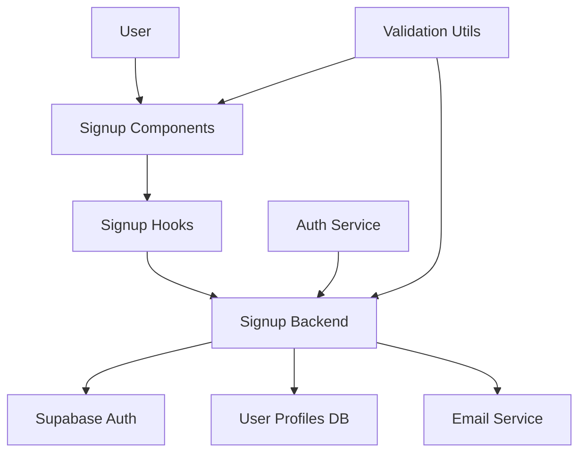

# 회원가입 & 역할선택 모듈화 설계

## 개요

| 모듈명 | 위치 | 설명 |
|--------|------|------|
| **Auth Service** | `src/features/auth/` | 기존 인증 관련 공통 모듈 활용 |
| **Signup Components** | `src/features/feature01-signup/components/` | 회원가입 폼 및 역할 선택 UI |
| **Signup Hooks** | `src/features/feature01-signup/hooks/` | 회원가입 상태 관리 훅 |
| **Signup Backend** | `src/features/feature01-signup/backend/` | 회원가입 API 및 비즈니스 로직 |

## Diagram



## Implementation Plan

### 1. 공통 모듈 활용 및 개선
**위치**: `src/features/auth/`

- **현재 상태**: 기본 인증 구조 구현됨
- **개선 사항**:
  - 인증 방식(email/external) 지원 추가
  - 사용자 역할(ad/influencer) 타입 정의 강화
  - 프로필 생성 시 인증 방식 저장 로직 추가

**단위 테스트**:
```typescript
// src/features/auth/__tests__/auth-service.test.ts
describe('AuthService', () => {
  test('should create user with email auth method', async () => {
    // 이메일 인증 사용자 생성 테스트
  });

  test('should create user with external auth method', async () => {
    // 외부 인증 사용자 생성 테스트
  });
});
```

### 2. 회원가입 컴포넌트 구현
**위치**: `src/features/feature01-signup/components/`

**구현할 컴포넌트**:
- `SignupForm.tsx` - 회원가입 메인 폼
- `RoleSelector.tsx` - 광고주/인플루언서 선택
- `AuthMethodSelector.tsx` - 이메일/외부 인증 선택

**QA 시트**:
- [ ] 폼 유효성 검사 (이메일 형식, 휴대폰번호 형식)
- [ ] 약관 동의 필수 체크
- [ ] 역할 선택 필수
- [ ] 인증 방식 선택 필수
- [ ] 중복 이메일 검증
- [ ] 인증 메일 발송 확인

### 3. 회원가입 훅 구현
**위치**: `src/features/feature01-signup/hooks/`

**구현할 훅**:
- `useSignup.ts` - 회원가입 상태 및 액션 관리
- `useAuthMethod.ts` - 인증 방식 선택 관리

### 4. 백엔드 API 구현
**위치**: `src/features/feature01-signup/backend/`

**구현할 파일**:
- `route.ts` - 회원가입 POST 엔드포인트
- `service.ts` - 회원가입 비즈니스 로직
- `schema.ts` - 입력/출력 스키마 정의
- `error.ts` - 회원가입 관련 에러 코드

**단위 테스트**:
```typescript
// src/features/feature01-signup/backend/__tests__/signup-service.test.ts
describe('SignupService', () => {
  test('should create user profile with correct auth method', async () => {
    // 인증 방식에 따른 프로필 생성 테스트
  });

  test('should send verification email for email auth', async () => {
    // 이메일 인증 시 메일 발송 테스트
  });
});
```

### 5. 통합 테스트
**위치**: `src/features/feature01-signup/__tests__/integration.test.ts`

**테스트 시나리오**:
- 이메일 인증 회원가입 전체 플로우
- 외부 인증 회원가입 플로우
- 중복 이메일 처리
- 인증 메일 미도착 시나리오
