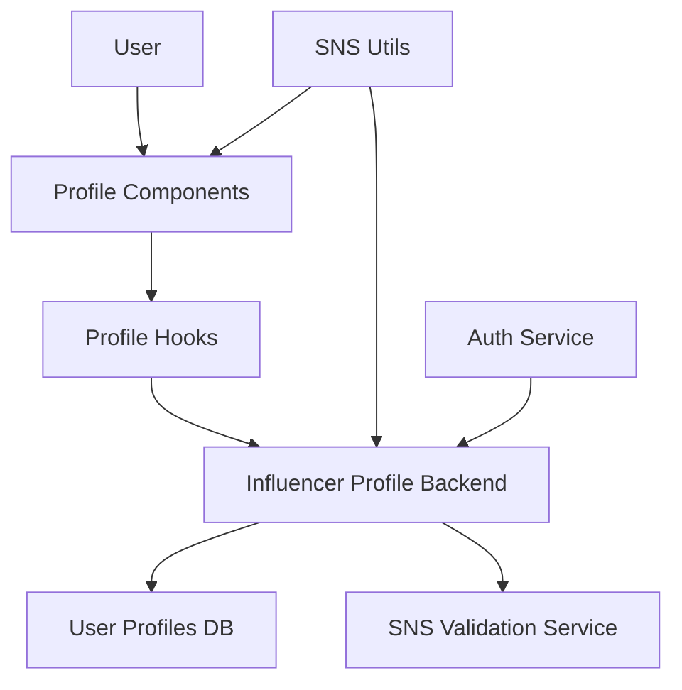

# 인플루언서 정보 등록 모듈화 설계

## 개요

| 모듈명 | 위치 | 설명 |
|--------|------|------|
| **Influencer Profile Service** | `src/features/feature02-influencer-profile/` | 인플루언서 프로필 관리 |
| **Profile Components** | `src/features/feature02-influencer-profile/components/` | 프로필 입력 폼 UI |
| **Profile Hooks** | `src/features/feature02-influencer-profile/hooks/` | 프로필 상태 관리 훅 |
| **SNS Validation** | `src/lib/validation/` | SNS URL 검증 유틸리티 |

## Diagram



## Implementation Plan

### 1. SNS 검증 유틸리티 구현
**위치**: `src/lib/validation/sns-utils.ts`

**기능**:
- 각 플랫폼별 URL 패턴 검증
- 팔로워 수 범위 검증 (0-100M)
- 채널명 형식 검증

**단위 테스트**:
```typescript
// src/lib/validation/__tests__/sns-utils.test.ts
describe('SNS Validation', () => {
  test('should validate Instagram URL format', () => {
    // 인스타그램 URL 형식 검증 테스트
  });

  test('should validate follower count range', () => {
    // 팔로워 수 범위 검증 테스트
  });
});
```

### 2. 인플루언서 프로필 컴포넌트 구현
**위치**: `src/features/feature02-influencer-profile/components/`

**구현할 컴포넌트**:
- `InfluencerProfileForm.tsx` - 메인 프로필 폼
- `SNSChannelInput.tsx` - SNS 정보 입력 컴포넌트
- `BirthDateSelector.tsx` - 생년월일 선택

**QA 시트**:
- [ ] 생년월일 만 14세 이상 검증
- [ ] SNS URL 실시간 형식 검증
- [ ] 팔로워 수 입력 제한 (숫자만, 범위 제한)
- [ ] 검증 상태 실시간 피드백
- [ ] 폼 제출 시 전체 유효성 검사

### 3. 프로필 관리 훅 구현
**위치**: `src/features/feature02-influencer-profile/hooks/`

**구현할 훅**:
- `useInfluencerProfile.ts` - 프로필 상태 및 액션 관리
- `useSNSValidation.ts` - SNS 검증 상태 관리

### 4. 백엔드 API 구현
**위치**: `src/features/feature02-influencer-profile/backend/`

**구현할 파일**:
- `route.ts` - 프로필 등록/수정 엔드포인트
- `service.ts` - 프로필 비즈니스 로직
- `schema.ts` - 입력/출력 스키마 정의
- `error.ts` - 프로필 관련 에러 코드

**단위 테스트**:
```typescript
// src/features/feature02-influencer-profile/backend/__tests__/profile-service.test.ts
describe('InfluencerProfileService', () => {
  test('should create profile with SNS validation', async () => {
    // SNS 정보와 함께 프로필 생성 테스트
  });

  test('should update verification status', async () => {
    // 검증 상태 업데이트 테스트
  });
});
```
