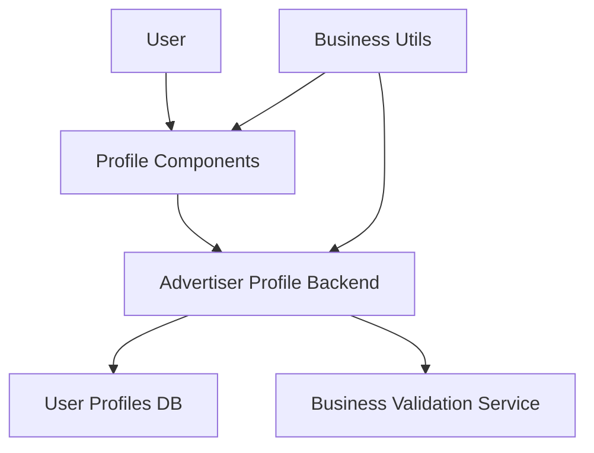

# 광고주 정보 등록 모듈화 설계

## 개요

| 모듈명 | 위치 | 설명 |
|--------|------|------|
| **Advertiser Profile Service** | `src/features/feature03-advertiser-profile/` | 광고주 프로필 관리 |
| **Business Validation** | `src/lib/validation/` | 사업자등록번호 검증 유틸리티 |
| **Profile Components** | `src/features/feature03-advertiser-profile/components/` | 회사 정보 입력 폼 |

## Diagram

## Implementation Plan

### 1. 사업자등록번호 검증 유틸리티 구현
**위치**: `src/lib/validation/business-utils.ts`

**기능**:
- 사업자등록번호 형식 검증 (XXX-XX-XXXXX)
- 중복 사업자등록번호 검사

### 2. 광고주 프로필 컴포넌트 구현
**위치**: `src/features/feature03-advertiser-profile/components/`

**구현할 컴포넌트**:
- `AdvertiserProfileForm.tsx` - 회사 정보 입력 폼
- `BusinessNumberInput.tsx` - 사업자등록번호 입력

### 3. 백엔드 API 구현
**위치**: `src/features/feature03-advertiser-profile/backend/`

**구현할 파일**:
- `route.ts` - 프로필 등록/수정 엔드포인트
- `service.ts` - 프로필 비즈니스 로직
- `schema.ts` - 입력/출력 스키마 정의
- `error.ts` - 프로필 관련 에러 코드
