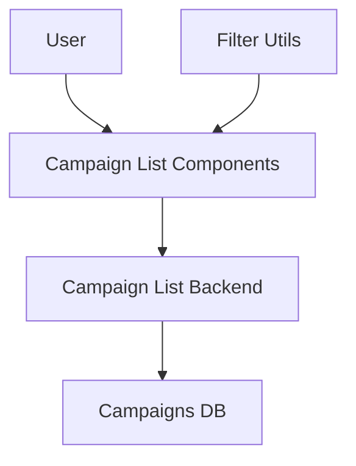

# 홈 & 체험단 목록 탐색 모듈화 설계

## 개요

| 모듈명 | 위치 | 설명 |
|--------|------|------|
| **Campaign List Service** | `src/features/feature04-browse-campaigns/` | 체험단 목록 조회/필터링 |
| **Campaign Card Components** | `src/features/feature04-browse-campaigns/components/` | 체험단 카드 UI |
| **Filter Components** | `src/lib/components/` | 재사용 가능한 필터 컴포넌트 |

## Diagram

## Implementation Plan

### 1. 체험단 목록 컴포넌트 구현
**위치**: `src/features/feature04-browse-campaigns/components/`

**구현할 컴포넌트**:
- `CampaignList.tsx` - 메인 목록 컴포넌트
- `CampaignCard.tsx` - 개별 체험단 카드
- `FilterBar.tsx` - 필터/정렬 바

### 2. 백엔드 API 구현
**위치**: `src/features/feature04-browse-campaigns/backend/`

**구현할 파일**:
- `route.ts` - 목록 조회 엔드포인트
- `service.ts` - 필터링 비즈니스 로직
